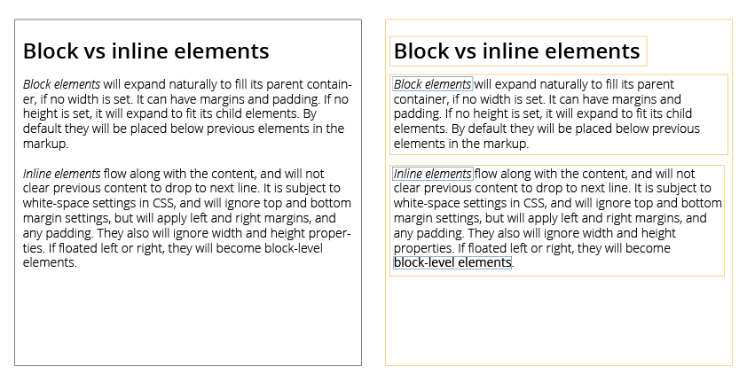

## CSS Introduction
CSS (Cascading Style Sheets) allows you to create rules that specify how an element, or the content of an element, should look. These rules can be reused for elements that should look the same.

### Understanding CSS
To understand how CSS works, you can imagine that there is an invisible box around every HTML element. CSS allows you to create rules that control the way that each individual box, and the content of that box, is presented.

In the images below you can see a HTML page. On the left side, you see how it would have been rendered in a browser. On the right side I have added outlines to each element so that you can see how CSS will treat each element as if it lives inside its own box. The block level elements are shown with an orange border, and inline elements have a blue border.



### Syntax
Each block of code is called a rule, and defines some style for an element. Each rule consists of a selector, choosing what element(s) to style, a property and a value. A rule looks like this:

<span style="color:#FAA21B;">p</span> { <br>
&nbsp;&nbsp;&nbsp;&nbsp;<span style="color:#79a2ce;">color:</span><span style="color: #0060A3;"> #0060A3</span>;<br>
}

The <span style="color:#FAA21B;">selector</span>, the name before the opening curly bracket ( { ), points to the element you want to style. The <span style="color:#79a2ce;">property</span> is, well, the property of the elements you want to affect, and the <span style="color: #0060A3;">value</span> is the value of that property.

In this case we change the font color of `p` from the browser default to the blue color <span style="color: #0060A3;"> #0060A3</span>. It is perhaps not intuitive that the `color` property affects the font color, but it does. You will learn more about how to use colors and how to style text later on in this chapter.

Each property-value pair is called an declaration. All declaration that makes up a rule, i.e. all declarations between the opening and closing curly bracket, is called a declaration block.

In order for the browser to understand that you are done defining a declaration, you need to end the line with a semicolon.

### Comments
As with HTML, you can make comments so that the content between the opening and closing tag is not considered when the code is executed. This can be used to comment out the code, or give explanations. In CSS, comments are written as such: `/* Some comment */`.

If you want to exclude some CSS rules without deleting it, you would enclose it with the comment tags, e.g.:
```
/*
.some-class{
  color: #1d1d1d;
}
*/
```

### Cascade
Cascade is the C in CSS (style sheets are the S and the S). This means that if there are two or more rules that apply to the same element, there is an order of preference, specifying which rule will be used.

This order of precedence is decided by:
* <b>The last rule</b>: If two rules affect the same property of the same element, the latter of the two will take precedence. That is, the last one written when you read from top to bottom.
* <b>Specificity</b>: If one selector is more specific than another, the most specific rule will take precedence. E.g. `p` is more specific than `*` (this selects all elements, more on that later), and `p b` is more specific than `p`.
* <b>Important</b>: Adding `!important` after any property value indicates that that declaration should be considered more important than other rules that apply to the same element. Use this with caution.

As for "the last rule", this precedence rule is further specified by the level at which you write your CSS. There are five levels of styles: inline style, embedded styles, external style sheet, user specified styles and browser default.

These are ordered in a hierarchy, where inline styles has the highest precedence, then embedded styles, external style sheets, user specified, and lastly browser defaults. That means that if some element has it's style specified several places, the specification with the highest precedence win, thus affecting the element.

You will soon learn about classes and IDs. But already now you can learn that IDs have a higher precedence than classes because they are more specific.

#### Inline styling
Inline styling is when you write your style directly on the element, e.g. in your HTML document. For a given paragraph you would e.g. write:

```
<p style="color: orange;
          font-family: arial, sans-serif;
          font-size: 16px;">
  This is some styled paragraph!
</p>
```
... which would render:

<p style="color: orange; font-family: arial, sans-serif; font-size: 16px;">This is some styled paragraph!</p>

There is a, perhaps obvious, drawback to this method. In the cases where you would want the same style on several paragraphs you would have to copy the style. If you then later would like to change the style, you would have to change it on all the places it was used. Using classes you only have to write a set of rules once.

#### Embedded styles
One way to use class and ID references (you will learn about classes and IDs in the following section), rather than writing inline CSS, is to write your style embedded. That is, you write it in your HTML document, but on a designated place, encapsulated by the `<style></style>` tags. You can write them wherever you want, but a good idea is to have them in your `<head>` section.

For the same paragraph style as above, you would then write:
```
<head>
  <style>
    p{
      color: orange;
      font-family: arial, sans-serif;
      font-size: 16px;
    }
  </style>
</head>
<body>
  <p>
    This is some styled paragraph!
  </p>
  <p>
    This is another paragraph with the same styling!
  </p>
</body>
```

This approach supports the <i>Don't repeat yourself</i> (DRY) principle, which says that you should not write the same code twice, making the code easier to maintain later on.

#### External style sheets
External style sheets looks like embedded styles, but differs in that the style is included from an external resource, meaning a different file than the HTML document. Using this approach, several HTML files can share the same styles.

I would recommend including the link to the style sheet in the `<head>` section of your document. You do that by writing:
```
<link href="path/to/stylesheet.css" rel="stylesheet">
```

Should you include several style sheets, which is possible, and some of them define the same property for the same class, the one included last will be used.

This is also true when you inside the same style sheet define the same property for the same class, the last declaration will be used.

You may wonder "what is a style sheet and how do I write one?" I am not going to say that it is easy, but it is quite easy. You do not have to do any document declaration or anything. Just start writing your rules, e.g. the top of the document could look like this:

```css
body{
    font-family: Helvetica, Arial, sans-serif;
    font-size: 16px;
}
```

... or any other rules you would like to have there. It is up to you!

#### User specified rules
A user can specify CSS rules in their browser. This can not be affected by your code, but the style sheets you provide will take preference, should they affect the same element.

#### Browser defaults
Lastly we have the browser default styles. These are styles used by the browsers when your style sheet has not defined any for an element. E.g. if you have not defined the `font-family` property for a paragraph tag, the paragraph would be in the browser default font, which on browsers on OSX is usually Helvetica, and browsers on Windows it is usually Verdana. These default may also vary across browsers on the same operating system.

If you want a consistent look across platforms you should define styles to override the browser default.

### Inheritance
Some properties are inherited by their parent element, e.g. `font-family` and `color`. That means that if you specify a `font-family` on the `<body>` element, all child elements (that is, all elements inside the `<body>` tag) will also have that same `font-family` value, unless the property is specified in the child element. E.g.:

```css
div{
  border-radius: 1px;
}

p{
  border-radius: inherit;
}
```

Not all properties are inherited automatically, such as the `border` properties. If these properties had been inherited, the page might have looked messy. But you can force properties to inherit values from their parent elements using `inherit` as the value of that property.

Inheritance saves you from having to apply some properties to as many elements, resulting in a simpler style sheet. E.g., for the the code snipped below, all child elements will have the same `font-family` because it is defined in the `<body>` element:

```
body{
  font-family: Verdana, sans-serif;
}

p{
  /* No need to define the font-family property,
  but we can specify other properties. */

  color: #1d1d1d;
}
```

### Selectors
In order to apply CSS rules to an element, the style needs either to be applied inline, or selected through a reference. In order to write maintainable code, it is recommended to separate style and content. That is, separate HTML and CSS. This is done through using classes or IDs.

On a page, you can only have one unique ID, while you can have several elements sharing the same class. If you want to apply the same style on several elements, e.g. a button, you would reference it using a class. If you instead only have one element of a kind on that page, e.g. main title, you would is an ID.

The class attribute is written as `<div class="class-name">`, and the ID attribute is written as `<div id="id-name">`.

In your style sheet, elements with an ID are referenced by:
```
#id-name {
  ...
}
```
and elements with classes are referenced by:
```
.class-name {
  ...
}
```
The difference being that IDs are referenced using the `#` in front of the name, and classes using `.` in front of the name.

Elements defined by the HTML standard can be referenced using only the element name, e.g. `p`, `body` and `section`. You would then write:

```
body {
  ...
}
```

Remember that there is a case of precedence with classes and IDs. As IDs are more specific than classes, they only apply to one element, they have a higher precedence than classes. That is, if a class and an ID describe the same property for the same element, the ID will be the one that is used. E.g. in the case of:

```
<style>
  #id-name{
    color: #000000; /* Font color: black */
  }

  .class-name{
    color: #FFFFFF; /* Font color: white */
  }
</style>

<div class="class-name" id="id-name">Some text</div>
```

the font color, described by the property `color` and the following value, would be black. It does not matter if the ID rule is written before or after the class rule.

It might seem silly to have two ways of referencing an element. After all, classes can be used to reference one element (but not vice versa). There are some advantages to using IDs that should be noted. As it only references one element, they are more efficient to use, compared to classes. This is because with classes the entire DOM has to be scanned for the element, while when the ID is found, there is no longer necessary to look for it. When we will learn about JavaScript, you will also see that IDs are necessary to reference the correct element to manipulate (more on that later).

There is no problem, as seen above, to combine classes and IDs. You can then have some style shared between elements, while some attributes are only for one element. You can also combine classes. E.g.:

```
<style>
.image-container{
  width: 300px;
  height: 200px;
}

.margin-left{
  margin-left: 30px;
}
</style>

<div class="image-container margin-left"></div>
```

#### Other selectors
You have now seen how we select classes and IDs, but it is possible to select several element at once, or select child elements. Just watch!

##### Universal selector
The `*` selector applies to all elements in the document.

```
* {
  ...
}
```

##### Type selector
Matches element names. In the example below the elements `<h1>`, `<h2>` and `<h3>` are targeted.

```
h1, h2, h3 {
  ...
}
```

##### Child selector
Matches an element that is a direct child of another. In the example below the selector targets any `<a>` element that are a children of an `<li>` element, that is all links within a list element. This rule does not affect other `<a>` elements on the page.

```
li > a {
  ...
}
```

##### Descendant selector
Matches an element that is a descendent of another specified element, and not just a direct child of that element. In the example below the selector targets any `<a>` element that is inside a `<p>` element, even if there are other elements nested between them.

```
p a {
  ...
}
```

##### Adjacent sibling selector
Matches an element that is the next sibling of another. In the example below the selector targets the first `<p>` element after any `<h1>` element, but not other `<p>` elements.

```
h1+p {
  ...
}
```

##### General sibling selector
Matches an element that is a sibling of another, although it does not have to be the directly preceding element. In the example below, if you had two `<p>` elements that are siblings of an `<h1>` element, this rule would apply to both.

```
h1~p {
  ...
}
```

### Color
In the previous sections, when I have have used the property `color` as an example, you see that I have written e.g `#000000`. This value is one of three ways to specify color in CSS. The `color` property specify the color of text inside an element.

The three ways are:

#### Hex codes
The example above is a hex code, a six-digit code that represents the amount of red, green and blue in a color, preceded by the `#` symbol. In the example above (#000000) the red, green and blue values are set to 0, and the color is thus complete black.

To get a black color, you would write:

```
color: #000000;
```

On the other side of the scale we find #FFFFFF, which is white. #FF0000 will give 100% red. You can probably guess which colors #00FF00 and #0000FF will give (that is correct, green and blue respectively).

If all two-digit pair has the same value, e.g. #1D1D1D, you will have some shade of grey. With the hex codes you can create 256 shades of grey, what a story that would make!

#### Color names
Alternatively you can use color names as the value. There are 147 predefined color names that are recognized by browsers. E.g. `blue`, `cyan` and `lightgoldenrodyellow`. You would then write:

```
color: cyan;
```

You can find the complete list [here](https://developer.mozilla.org/en-US/docs/Web/CSS/color_value).

#### RGB values
RGB values express colors in terms of how much red, green and blue are used to make it. The values are an integer from 0 to 255. You do that in the following way:

```
color: rgb(0, 96, 163);
```

... which would give the same blue color as #0060A3.

If you want the opacity to be anything but 100%, you can use `rgba`. The r, g and b are red, green and blue, and the a is short for alpha, and controls the alpha channel. Alpha channel is the opacity, described by a number between 0 and 1. If the opacity is at 1, you can not see trough the color. If it is a 0, you can not see the color, and then there is everything in between. You would write it:

```
color: rgba(0, 96, 163, 0.5);
```

to have a opacity at 50%.

#### Finding colors to use
There is an ocean of possibilities when choosing a color. You will find colors that goes well together, and those that doesn't. I will not talk about color theory, but would recommend checking out [Adobe Color](https://color.adobe.com/) when you want to choose colors that go well together, creating a fine color profile for your website.

### Margin and padding
All HTML elements can be considered a box, and each box (HTML element) has the properties margin, border, padding and content. Together these properties is called the box model.

#### The box model


The content area is the area that contains the content of the element, e.g. text or image. It can have a background color or an image (an image will hide the background color). Text and images are located inside the content edge. If the CSS box-sizing property is set to default, the properties width, min-width, max-width, height, min-height and max-height control the content size. If you do not specify at least one pair of these properties, the content's size will determine the size.

The padding area extends to the border surrounding the padding. When the content area has a background, color, or image set on it,  will be extended into the padding. Text will not be extended. The padding is located inside the padding edge.

The space between the padding and the content edge can be controlled using the padding-top, padding-right, padding-bottom, padding-left and the shorthand padding CSS properties.

The border area extends the padding area to the area containing the borders. It is the area inside the border edge, and its dimensions are defined by the border-width property, or the shorthand `border`.

The margin area extends the border area with an empty area used to separate the element from its neighbors. It is the area inside the margin edge, and its dimensions are the margin-box width and the margin-box height.

The size of the margin area is controlled using the CSS properties margin-top, margin-right, margin-bottom, margin-left, or the shorthand `margin`.

### Center elements
If you want to center your content in the browser window, that is center your outer element, you can use `margin-left:auto` and `margin-right:auto` to do so. Your element needs then to be less than 100% of the browser window.

### Borders
Borders can be styled using the `border-style`, `border-color` and `border-width`.

Border-style can be amongst other be:
* none
* hidden
* dotted
* dashed
* solid
* double

See more styles with examples at  [MDN](https://developer.mozilla.org/en-US/docs/Web/CSS/border-style). The border-color property's value is set using any way of representing color, e.g. hex or rgb. Border-width defines the width of the border, and the value is described using a measure of size, e.g. px. The following code snipped would make a 4px wide dashed and blue border:

```CSS
border-width: 4px;
border-style: dashed;
border-color: #0060A3;
```

In stead of defining each property on a separate line, you can use the border shorthand, e.g. for the example above you would write:

```css
border: 4px dashed #0060A3;
```

In addition, you can have different styles for the different sides by adding `-top`, `-bottom`, `-left` or `-right`. E.g. if you want to have dashed borders on the side, while the top and bottom is solid, you would write:

```css
border-top-style: solid;
border-bottom-style: solid;
border-left-style: dashed;
border-right-style: dashed;
border-width: 2px;
```

Using the side name (e.g. `-top`) can also be used for colors and widths.

### Text and fonts

When designing a web site, it is important to consider the text, as it can have a significant effect on how readable your pages are. There are many different options and combinations possible, so I will not go into great detail on the typography (that could be a book in it self, and indeed it is. Actually there are several. If you only want to read one of them, I would recommend Thinking With Type by Ellen Lupton). Rather you will learn the tools so that you know what properties you can change to create a web site that is easily readable and good looking.

First we need to talk a bit about typeface terminology:

#### Terminology
Firstly, there are three typeface classifications you should know about (even though there are several more), namely <i>serif</i>, <i>sans-serif</i> and <i>monospace</i>.

<p style="Font-family: Georgia">Serif fonts have extra detail on the ends of the main strokes of the letteres. These details are known as serifs. In print, serif fonts were traditionally used for long texts because they where considered easier to read. The font family used for this paragraph is Georgia.</p>

<p style="Font-family: Helvetica">Sans-serif fonts have straight ends to letters, and therefore have a much cleaner design. Screens have a lower resolution than print. So, if the text is small, sans-serif fonts can be clearer to read. The font family used for this paragraph is Helvetica</p>

<p style="Font-family: Courier">Every letter in a monospaced (or fixed width) font is the same width (non-monospace fonts have different widths). Monospace fonts are commonly used for code because they align nicely, making the text easier to follow. The font family used for this paragraph is Courier.</p>

Secondly, font families can have different weights and styles. The weights are <i>light</i>, <i>medium</i>, <i>regular</i>, <i>bold</i> and <i>black</i>, and describes the thickness of the font. The style of the font can be <i>normal</i>, <i>italic</i> or <i>oblique</i>. We also have size, how large each letter is.

Thirdly we need to talk about font families. Within each classification we have different font families. A font is one specific combination of the mentioned attributes within a font family. That is, Arial 12px regular is another font than Arial 14px regular.

#### Setting the font
Now that we know some words, we can put them to use. The CSS properties that affects your font that you definitely need to know are:
* font-family
* font-weight
* font-size
* line-height
* text-align
* color

`font-family` is used to define the font family used. If none is defined, the browser's default will be used. When defining font family, you should define fallback families, in case the first one is not present on the client. It is possible to add fonts from e.g. Google fonts, the chosen font then doesn't have to be present on the client. Most often locally stored fonts are used, e.g. Arial and Georgia (which are considered web safe fonts because they are installed on all clients).

The `font-family` property is written like this:
```css
font-family: Georgia, Times New Roman, serif;
```
Notice the `serif` value at the end. This says that "if any of the preceding fonts are not available, choose the browser's default serif font."

`font-weight` are written like this:
```css
font-weight: bold;
```

`font-size` takes a size as a value. It is easiest to start out with px.

```css
font-size: 22px;
```

Line height defines how high a line of text is. When the line height increases, the text does not increase in size, only the line, so the text will have more air above and below it. Increased line height can increase the readability of the text. A rule of thumb is to have 1.2x to 1.5x line height. The line height property can take a percentage (%), a length (px) or number (will be multiplied with the current font size) as a value.

```css
line-height: 2; /* will multiply the line height with 2 */
line-height: 150%; /* will make the line height 150% of the original */
line-height: 20px; /* will make the line height 20px high */
```

If you want to vertically align text in a box you know the height of, you can use line height to do so by setting the value equal to the box' height.

Should you want to horizontally align the text, you should use the `text-align` property, which takes one of four values: left, right, center and justify. Justify stretches the lines so that each line has equal width, like in newspapers. Be aware of using justify, as the readability will suffer because of it, but it might used for design purposes.

Use the `color` property to set the color of the font. How to do this is described under the color chapter. In short, your write:

```css
color: darkgrey;
```

You can choose between hex codes, color names and RGB values as your prefered value.

#### A word to the wise

This section is only concerned with styling fonts, though there is more to web design than that. If you want to learn how to design your text so that it is readable and legible, you should read articles on typography, readability and legibility. A good starting point, should you want to read more, is to check out [Smashing Magazine's "Size Matters: Balancing Line Length And Font Size In Responsive Web Design"](https://www.smashingmagazine.com/2014/09/balancing-line-length-font-size-responsive-web-design/) and [fonts.com's "It’s About Legibility"](https://www.fonts.com/content/learning/fontology/level-4/fine-typography/legibility). You can also read my article in [Offline 2016-2](https://online.ntnu.no/media/images/offline/offline_nr_2_-_2016.pdf) on page 22 "font-family: sans-serif, serif, wtf;" (shameless self promotion).

If you want to use other fonts than the standard font families available, you can check out [Google Fonts](https://www.google.com/fonts).

#### Background color
Even though I have only talked about text color in this section, you should be aware that you also can set the background color of an element using the `background-color` property.

#### Contrast

Choosing the correct foreground (text) color and background color is important for legibility. When the contrast between the foreground and background is low, the text is harder to read. This is particularly a problem for those with visual impairments and color blindness, and it affects those with poor monitors and sunlight on their screens.

Text with a high contrast is easier to read. However, if the text is long, then too much contrast can make it harder to read too.

For long spans of text, reducing the contrast a little bit improves readability. Also note that it is better to read dark text on a white background than white text on a black background. I often choose a off-white background and a dark grey text.

If you want to have a dark background and light text, you can increase the weight of the font and the line height to make reading easier.

### Pseudo-classes
A pseudo classes (pseudo selector) is a keyword added to the selector specifying a special state of the element to be selected. For example :hover will apply a style when the user hovers over the element specified by the selector. As I am sure you remember, the selector is the word before the opening curly bracket ({) in a CSS rule. The pseudo-class follows the selector, with this syntax:

```css
selector:pseudo-class{
  property: value;
}
```

Pseudo-classes, together with pseudo-elements (which you will learn in the next chapter), let you apply a style to an element not only in relation to the content of the document tree, but also in relation to external factors like the history of the navigator (:visited, for example), the status of its content (like :checked on some form elements), or the position of the mouse (like :hover which lets you know if the mouse is over an element or not).

Pseudo-classes is probably most used to style links in their different states (link, visited, hover, active). If you want the color to change e.g. on hover, you would write:

```css
a:hover{
  color: green;
}
```

When you are styling links, `a:hover` must come after `a:link` and `a:visited` in the CSS rule in order for it to take effect. `a:active` must come after `a:hover`. If you have trouble with your style not working, this might be it.

Pseudo-classes are not case sensitive. You can use pseudo-classes on all elements. Over at [MDN](https://developer.mozilla.org/en-US/docs/Web/CSS/Pseudo-classes) you can find a complete list of the pseudo-classes.
